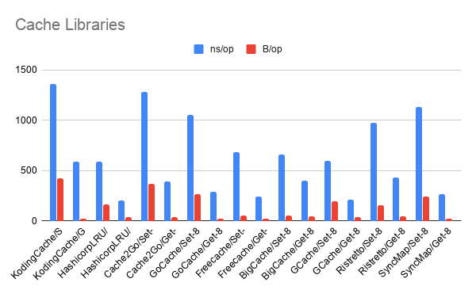

## Go Cache Benchmarks

Benchmarks of in-memory cache libraries for Go with expiration/TTL support.

## Run Test

    go get
    go test -bench=. -benchmem

## Results

```
goos: linux
goarch: amd64
pkg: github.com/Xeoncross/go-cache-benchmark
cpu: 12th Gen Intel(R) Core(TM) i9-12900H
BenchmarkKodingCache/Set-20              1000000                1228 ns/op           424 B/op          5 allocs/op
BenchmarkKodingCache/Get-20              2796266               556.8 ns/op            23 B/op          1 allocs/op
BenchmarkHashicorpLRU/Set-20             3767683               314.9 ns/op           166 B/op          8 allocs/op
BenchmarkHashicorpLRU/Get-20            12501775               93.07 ns/op            40 B/op          3 allocs/op
BenchmarkCache2Go/Set-20                 1000000                1147 ns/op           370 B/op          9 allocs/op
BenchmarkCache2Go/Get-20                 3778624               299.9 ns/op            39 B/op          2 allocs/op
BenchmarkGoCache/Set-20                  2193494               760.0 ns/op           196 B/op          7 allocs/op
BenchmarkGoCache/Get-20                  3419902               335.8 ns/op            23 B/op          1 allocs/op
BenchmarkFreecache/Set-20                3461131               416.0 ns/op            49 B/op          3 allocs/op
BenchmarkFreecache/Get-20                9705312               123.3 ns/op            24 B/op          2 allocs/op
BenchmarkBigCache/Set-20                 2625801               561.1 ns/op            75 B/op          4 allocs/op
BenchmarkBigCache/Get-20                 2931568               441.2 ns/op            52 B/op          3 allocs/op
BenchmarkGCache/Set-20                   2898984               396.7 ns/op           191 B/op          7 allocs/op
BenchmarkGCache/Get-20                   9151436               121.9 ns/op            39 B/op          2 allocs/op
BenchmarkRistretto/Set-20                1798761               790.8 ns/op           299 B/op          7 allocs/op
BenchmarkRistretto/Get-20                2061169               590.2 ns/op            47 B/op          3 allocs/op
BenchmarkWTF/Set-20                      5397871               225.5 ns/op            79 B/op          5 allocs/op
BenchmarkWTF/Get-20                     16704721               76.09 ns/op            23 B/op          1 allocs/op
BenchmarkSyncMap/Set-20                  2144700               756.5 ns/op           158 B/op          7 allocs/op
BenchmarkSyncMap/Get-20                  3089744               358.1 ns/op            23 B/op          1 allocs/op
PASS
ok      github.com/Xeoncross/go-cache-benchmark 52.422s
```



_Note: sync.Map does not support expiration and is only included for comparison_
_Note: hashicorp/golang-lru does not support expires/TTL and is only included for comparison_


## Warning

Please note that these libraries are benchmarked against storage of small strings. If you are storing large blobs the results _will_ differ and you are encouraged to benchmark with your custom payloads.

- https://github.com/dgraph-io/ristretto
- https://golang.org/pkg/sync/#Map
- https://github.com/coocood/freecache
- https://github.com/allegro/bigcache
- https://github.com/patrickmn/go-cache
- https://github.com/muesli/cache2go
- https://github.com/bluele/gcache
